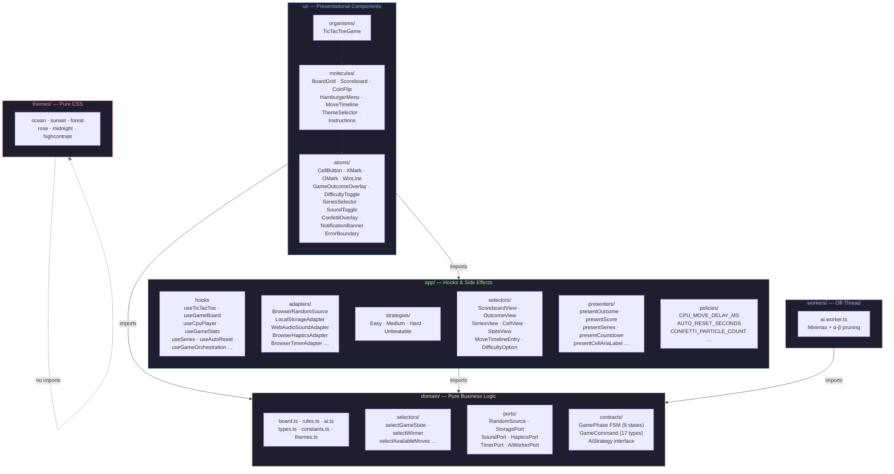
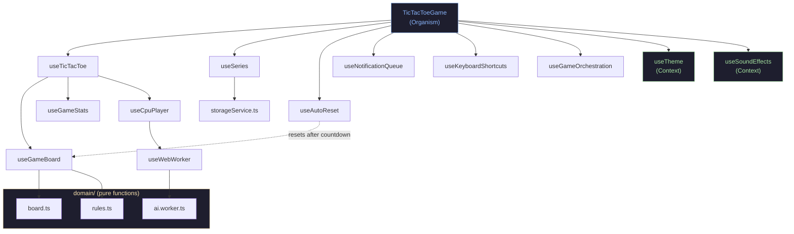
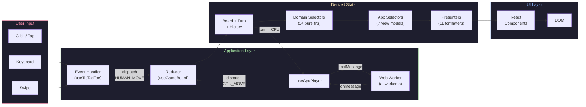
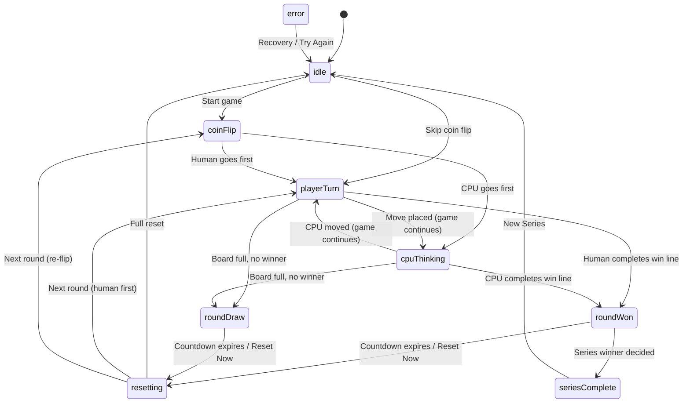
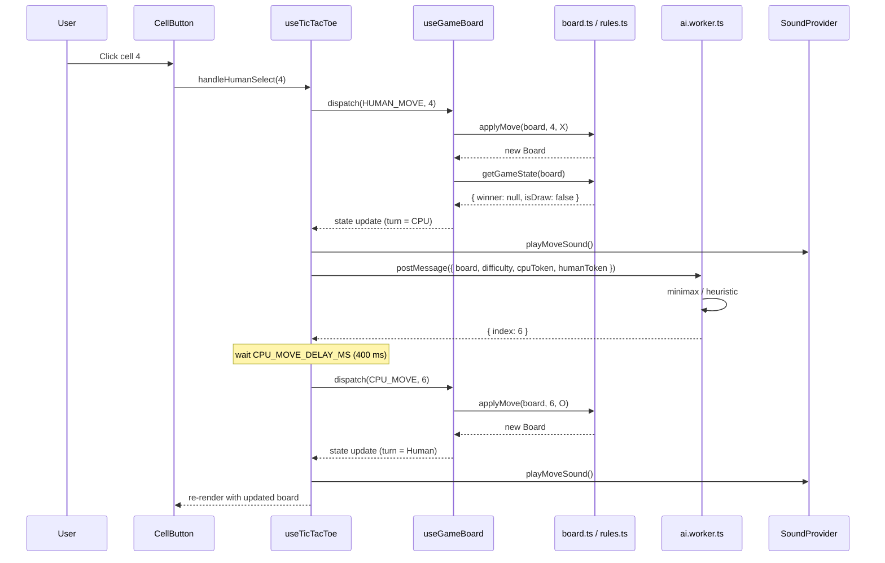
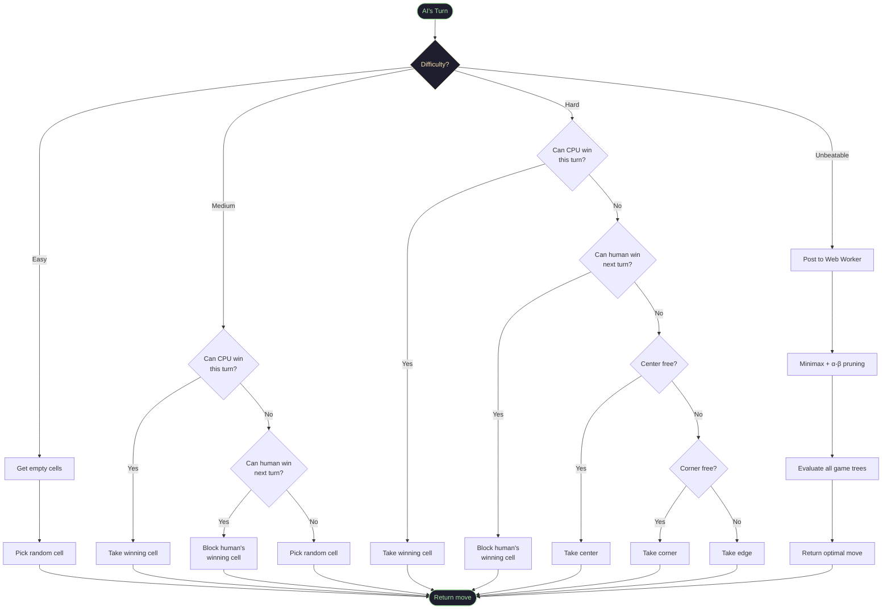
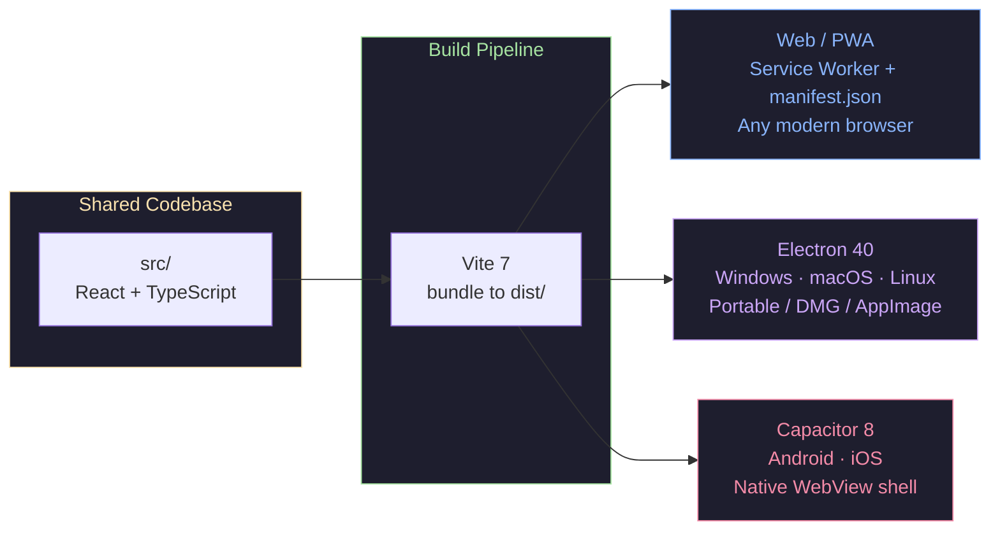

# 🎮 Tic-Tac-Toe

[](https://github.com/facebook/react)
[](https://github.com/vitejs/vite)
[](https://github.com/microsoft/TypeScript)
[](https://github.com/css-modules/css-modules)
[](https://github.com/electron/electron)
[](https://github.com/ionic-team/capacitor)
[](https://github.com/nodejs/node)
[](https://github.com/pnpm/pnpm)
[](https://github.com/eslint/eslint)
[](https://github.com/prettier/prettier)
[](https://github.com/android/platform-tools)
[](LICENSE)
[](https://github.com/scottdreinhart/tictactoe)

A cross-platform Tic-Tac-Toe game with 4 AI difficulty levels, 7 color themes, Best-of-N series mode, full accessibility support, and native desktop + mobile builds — powered by React, Vite, Electron, and Capacitor.

> [!CAUTION]
> CURRENTLY FOCUSED ON UI/UX AESTHETICS AND STANDARDIZING THEM ACROSS ALL SUPPORTED PLATFORMS BY WAY OF MEDIA TYPES

**⚠️ PROPRIETARY SOFTWARE — All Rights Reserved**

© 2026 Scott Reinhart. This software is proprietary and confidential.
Unauthorized reproduction, distribution, or use is strictly prohibited.
See [LICENSE](LICENSE) file for complete terms and conditions.

> [!CAUTION]
> **LICENSE TRANSITION PLANNED** — This project is currently proprietary. The license will change to open source once the project has reached a suitable state to allow for it.

[Project Structure](#project-structure) · [Getting Started](#getting-started) · [Tech Stack](#tech-stack) · [Game Flow](#game-flow) · [Contributing](#contributing) · [Remaining Work](#remaining-work) · [Future Improvements](#future-improvements) · [Portfolio Services](#portfolio-services) · [Future Game Ideas](#future-game-ideas)

## Project Structure

```
src/
├── domain/                           # Pure, framework-agnostic logic
│   ├── types.ts                      # Central type definitions (Token, Board, GameState, Score, etc.)
│   ├── constants.ts                  # TOKENS, WIN_LINES, BOARD_SIZE, CPU_DELAY_MS
│   ├── board.ts                      # Board operations (create, apply move, get empty cells)
│   ├── rules.ts                      # Win/draw detection (returns winning line)
│   ├── ai.ts                         # CPU move selection (random / medium / smart / minimax unbeatable)
│   ├── themes.ts                     # Color theme, mode & colorblind definitions + DEFAULT_SETTINGS
│   ├── ports/                        # Hexagonal port interfaces (dependency inversion boundaries)
│   │   ├── RandomSource.ts           # RandomSource port — abstract random number generation
│   │   ├── StoragePort.ts            # StoragePort port — abstract persistence (load/save/remove)
│   │   ├── SoundPort.ts              # SoundPort port — abstract audio playback
│   │   ├── HapticsPort.ts            # HapticsPort port — abstract haptic feedback
│   │   ├── TimerPort.ts              # TimerPort port — abstract setTimeout / clearTimeout / now
│   │   ├── AiWorkerPort.ts           # AiWorkerPort port — abstract off-thread AI computation
│   │   └── index.ts                  # Barrel export — re-exports all port interfaces
│   ├── selectors/                    # Pure selector functions (derived state from domain models)
│   │   └── index.ts                  # 14 selectors (selectWinner, selectAvailableMoves, etc.)
│   ├── contracts/                    # FSM states, legal transitions, command types, strategy interface
│   │   └── index.ts                  # GamePhase (9 states), LEGAL_TRANSITIONS, GameCommand (17 types)
│   └── index.ts                      # Barrel export — re-exports all domain modules
├── app/
│   ├── haptics.ts                    # Vibration API wrapper (tick, tap, heavy feedback)
│   ├── sounds.ts                     # Web Audio API synthesized SFX + jingles
│   ├── storageService.ts             # localStorage JSON wrapper (generic load<T>/save/remove)
│   ├── ThemeContext.tsx               # React Context provider for theme/mode/colorblind settings
│   ├── SoundContext.tsx               # React Context provider for sound state + guarded playback
│   ├── useTicTacToe.ts               # Composition: useGameBoard + useGameStats + useCpuPlayer
│   ├── useGameBoard.ts               # Core reducer: board, turn, focus, history, undo/redo
│   ├── useGameStats.ts               # Score, win-streak, best-time tracking
│   ├── useCpuPlayer.ts               # AI difficulty + Web Worker scheduling
│   ├── useGameOrchestration.ts       # Game-state → sounds, confetti, notifications, outcome CSS
│   ├── useSeries.ts                  # Best-of-N series state (score, winner, games played)
│   ├── useGridKeyboard.ts            # Reusable document-level keyboard navigation hook
│   ├── useKeyboardShortcuts.ts       # Declarative global shortcut binding (Ctrl+Z/Y)
│   ├── useSoundEffects.ts            # Sound toggle + play functions (respects reduced-motion)
│   ├── useTheme.ts                   # Theme / mode / colorblind persistence + DOM sync
│   ├── useAutoReset.ts               # 15-second auto-reset countdown after game end
│   ├── useSwipeGesture.ts            # Touch swipe detection for mobile grid navigation
│   ├── useCoinFlipAnimation.ts       # Coin flip animation lifecycle (auto-stop, reveal delay)
│   ├── useNotificationQueue.ts       # FIFO notification queue (enqueue / dismiss / update)
│   ├── useSmartPosition.ts           # Auto-detect left/right alignment for dropdowns
│   ├── useDropdownBehavior.ts        # Outside click/touch/Escape close + focus trap
│   ├── usePrevious.ts                # Generic hook capturing previous render value
│   ├── useWebWorker.ts               # Web Worker lifecycle management (create/terminate)
│   ├── adapters/                     # Port implementations (Adapter pattern)
│   │   ├── BrowserRandomSource.ts    # Math.random() adapter for RandomSource
│   │   ├── LocalStorageAdapter.ts    # localStorage adapter for StoragePort
│   │   ├── WebAudioSoundAdapter.ts   # Web Audio API adapter for SoundPort
│   │   ├── NullSoundAdapter.ts       # No-op sound adapter (Null Object pattern)
│   │   ├── BrowserHapticsAdapter.ts  # navigator.vibrate() adapter for HapticsPort
│   │   ├── NullHapticsAdapter.ts     # No-op haptics adapter (Null Object pattern)
│   │   ├── BrowserTimerAdapter.ts    # window timers adapter for TimerPort
│   │   ├── WebWorkerAiAdapter.ts     # Web Worker adapter for AiWorkerPort
│   │   ├── InMemoryStorageAdapter.ts # Map-backed storage for tests
│   │   └── index.ts                  # Barrel export — re-exports all adapters
│   ├── strategies/                   # Strategy implementations (Strategy pattern)
│   │   └── index.ts                  # 4 AI strategies + registry + lookup
│   ├── selectors/                    # App-layer selectors (presentation-ready derived state)
│   │   └── index.ts                  # ScoreboardView, OutcomeView, SeriesView, CellView, etc.
│   ├── policies/                     # Extracted magic numbers & configurable thresholds
│   │   └── index.ts                  # Timing, animation, confetti, gesture, layout, sound policies
│   ├── presenters/                   # Pure functions shaping domain state → display strings
│   │   └── index.ts                  # presentOutcome, presentScore, presentSeries, etc.
│   └── index.ts                      # Barrel export — re-exports all app hooks and services
├── ui/
│   ├── atoms/
│   │   ├── ErrorBoundary.tsx          # React Error Boundary — crash isolation with themed fallback + retry
│   │   ├── index.ts                  # Barrel export — re-exports all atoms
│   │   ├── CellButton.tsx            # Single cell with SVG mark rendering + neon glow + winning highlight
│   │   ├── CellButton.module.css     # Scoped styles for CellButton (neon drop-shadow filters)
│   │   ├── XMark.tsx                 # Animated SVG "X" (React.memo, draw-on effect)
│   │   ├── OMark.tsx                 # Animated SVG "O" (React.memo, draw-on effect)
│   │   ├── WinLine.tsx               # Animated SVG line drawn through winning cells
│   │   ├── WinLine.module.css        # Scoped styles for WinLine
│   │   ├── GameOutcomeOverlay.tsx    # Large animated "YOU WIN!/LOSE!/DRAW!" text overlay
│   │   ├── GameOutcomeOverlay.module.css # Scoped styles for GameOutcomeOverlay
│   │   ├── DifficultyToggle.tsx      # Easy/Medium/Hard/Unbeatable AI toggle (React.memo)
│   │   ├── DifficultyToggle.module.css # Scoped styles for DifficultyToggle
│   │   ├── SeriesSelector.tsx        # Free/Bo3/Bo5/Bo7 series mode toggle (React.memo)
│   │   ├── SeriesSelector.module.css # Scoped styles for SeriesSelector
│   │   ├── SoundToggle.tsx           # Sound on/off toggle (React.memo)
│   │   ├── SoundToggle.module.css    # Scoped styles for SoundToggle
│   │   ├── ConfettiOverlay.tsx       # Canvas-based confetti particle animation on win
│   │   ├── NotificationBanner.tsx    # Floating queued notification overlay on board center
│   │   └── NotificationBanner.module.css # Scoped styles for NotificationBanner
│   ├── molecules/
│   │   ├── index.ts                  # Barrel export — re-exports all molecules
│   │   ├── BoardGrid.tsx             # 3×3 grid with WinLine overlay + background image + reset animation
│   │   ├── BoardGrid.module.css      # Scoped styles for BoardGrid
│   │   ├── Scoreboard.tsx            # Persistent score display with turn indicator + series progress
│   │   ├── Scoreboard.module.css     # Scoped styles for Scoreboard
│   │   ├── CoinFlip.tsx              # Animated virtual coin flip (X/O sides) at app start
│   │   ├── CoinFlip.module.css       # Scoped styles for CoinFlip
│   │   ├── HamburgerMenu.tsx         # Accessible ☰ menu with focus trap + portal-based panel
│   │   ├── HamburgerMenu.module.css  # Scoped styles for HamburgerMenu
│   │   ├── Instructions.tsx          # ⓘ info icon with auto-positioned tooltip
│   │   ├── Instructions.module.css   # Scoped styles for Instructions
│   │   ├── MoveTimeline.tsx          # Sliding drawer with score, streak, best-time, move history & undo/redo
│   │   ├── MoveTimeline.module.css   # Scoped styles for MoveTimeline
│   │   ├── ThemeSelector.tsx         # Collapsible theme/mode/colorblind settings panel
│   │   └── ThemeSelector.module.css  # Scoped styles for ThemeSelector
│   ├── organisms/
│   │   ├── index.ts                  # Barrel export — re-exports all organisms
│   │   ├── TicTacToeGame.tsx         # Top-level game component (pure composition)
│   │   └── TicTacToeGame.module.css  # Scoped styles for TicTacToeGame
│   ├── index.ts                      # Barrel export — re-exports all UI sub-layers
│   ├── ui-constants.ts               # UI layout constants (sizes, breakpoints)
│   └── utils/
│       ├── cssModules.ts             # cx() conditional class binding utility
│       └── index.ts                  # Barrel export — re-exports utilities
├── vite-env.d.ts                     # Ambient type declarations (CSS Modules, assets)
├── themes/                           # Lazy-loaded theme CSS chunks
│   ├── forest.css
│   ├── highcontrast.css              # High-contrast theme (default)
│   ├── midnight.css
│   ├── ocean.css
│   ├── rose.css
│   └── sunset.css
├── workers/
│   └── ai.worker.ts                  # Off-main-thread minimax AI computation
├── index.tsx                         # React entry point
└── styles.css                        # CSS with themes, animations, media queries

public/
├── backgrounds/                      # Theme background images
│   ├── circuit.png                   # Classic theme background
│   ├── cityscape.png                 # Midnight theme background
│   ├── laser.png                     # Ocean theme background
│   └── matrix.png                    # High contrast theme background
├── apple-touch-icon.svg              # Apple touch icon for iOS home screen
├── icon-maskable.svg                 # Maskable icon for PWA adaptive icons
├── icon.svg                          # Standard app icon
├── manifest.json                     # PWA manifest
├── sw.js                             # Service worker for offline play
└── offline.html                      # Offline fallback page

index.html                            # HTML entry point
package.json                          # Dependencies & scripts
pnpm-lock.yaml                        # pnpm lockfile
pnpm-workspace.yaml                   # pnpm workspace config
LICENSE                               # Proprietary license terms
capacitor.config.ts                   # Capacitor native app configuration
electron/
├── main.js                           # Electron main process (BrowserWindow, dev/prod loading)
├── preload.js                        # Sandboxed context bridge (exposes platform info)
└── launch-dev.sh                     # WSL helper to launch Windows Electron from WSL
launch-linux-build.sh                 # WSL script to build Linux AppImage from WSL/Ubuntu

tsconfig.json                         # TypeScript config (strict mode + @/ path aliases)
vite.config.js                        # Vite config + rollup-plugin-visualizer + @/ resolve aliases
eslint.config.js                      # ESLint flat config (React + hooks + Prettier + boundary enforcement)
.prettierrc                           # Prettier formatting rules
.npmrc                                # npm/pnpm config (save-exact=true)
.gitignore                            # Git ignore rules (node_modules, dist, release, etc.)
.nvmrc                                # Node.js version pin (v24) for nvm users
```

## Features

### Game Logic

- **Human (X) vs CPU (O)**: Human plays first
- **Board Representation**: 9-cell array with immutable updates
- **Win Detection**: All 8 winning lines checked (3 rows, 3 columns, 2 diagonals)
- **Draw Detection**: Board full + no winner = draw
- **CPU Move**: Four difficulty levels — Easy (random), Medium (win/block + random), Hard (heuristic priority: win → block → center → corner → edge), Unbeatable (minimax with alpha-beta pruning, cannot be beaten)
- **Score Tracking**: Win/loss/draw tallies persisted across rounds; displayed in persistent scoreboard above the board
- **Best-of-N Series**: Free play, Best-of-3, Best-of-5, or Best-of-7 — series score tracked separately; "New Series" button on series completion
- **Win-Line Highlight**: Winning 3 cells pulse with animated glow + animated SVG line drawn through the 3 winning cells
- **Difficulty Toggle**: Pill-shaped Easy/Medium/Hard/Unbeatable switch
- **Series Selector**: Pill-shaped Free/Bo3/Bo5/Bo7 series mode toggle
- **Auto-Reset**: 15-second countdown after game end; auto-starts a new round ("Reset Now" button available)
- **Sound Effects**: Synthesized via Web Audio API — move pop, win fanfare (C-major arpeggio + chord ~2s), loss jingle (descending E-minor ~2s), draw tone (toggleable, respects `prefers-reduced-motion`)
- **Web Worker AI**: CPU move computation runs off-main-thread in `ai.worker.ts`; maintains 60 FPS during complex calculations
- **Undo / Redo**: Step backward/forward through complete game history; keyboard shortcuts `Ctrl+Z` (undo), `Ctrl+Y` / `Ctrl+Shift+Z` (redo); click any move in the timeline to jump to that position
- **Move History Timeline**: Sliding drawer with sequential move list, token icons, current position indicator, undo/redo buttons, score, streak, and best time
- **First-Move Coin Flip**: Animated virtual coin with X/O sides flips at app start to determine who goes first
- **Streak Tracking**: Consecutive human wins counter (🔥); resets on CPU win, draw, or undo of a winning move
- **Best-Time Tracking**: Fastest win time measured in real-world seconds from first move to winning move; persists across rounds
- **No External Game Libraries**: All logic built from scratch — board, rules, AI, sounds, themes
- **React.memo Optimization**: Pure presentational components (`XMark`, `OMark`, `DifficultyToggle`, `SeriesSelector`, `SoundToggle`, `ThemeSelector`) wrapped in `React.memo` to skip unnecessary re-renders
- **21 Application Hooks & Services**: `useTicTacToe` (composition), `useGameBoard`, `useGameStats`, `useCpuPlayer`, `useGameOrchestration`, `useSeries`, `useGridKeyboard`, `useKeyboardShortcuts`, `useSoundEffects`, `useTheme`, `useAutoReset`, `useSwipeGesture`, `useCoinFlipAnimation`, `useNotificationQueue`, `useSmartPosition`, `useDropdownBehavior`, `usePrevious`, `useWebWorker`, `haptics`, `storageService`, `sounds` — extracted for composability and reuse
- **Zero Known Vulnerabilities**: All 8 historical CVEs resolved (5 high, 2 moderate, 1 low); 0 known vulnerabilities

### Visual Design

- **SVG Marks**: X and O rendered as animated SVGs with stroke-dasharray draw-on effect and neon glow (`filter: drop-shadow()` using theme X/O colors)
- **7 Color Themes**: Classic, Ocean, Sunset, Forest, Rose, Midnight, High Contrast (default) — each with unique accent gradient
- **Theme Background Images**: Per-theme background images (matrix, circuit, cityscape, laser) rendered as board overlays via `::before` pseudo-element, scaled to fill the entire board (`background-size: 100% 100%`)
- **Light / Dark Mode**: System (auto), Light (forced), or Dark (forced) — persisted to localStorage
- **4 Colorblind Modes**: Red Weakness, Green Weakness, Blue Weakness, Monochrome — overrides X/O colors for visibility
- **CSS Custom Properties**: All colors/sizes driven by CSS variables for easy theming
- **Cell Animations**: Pop-in effect when marks are placed; winning cells pulse with enhanced triple-layer neon glow
- **Outcome Animations**: Win glow, loss shake, draw fade — CSS class applied to game container
- **Game Outcome Overlay**: Large animated "YOU WIN!", "YOU LOSE!", or "DRAW!" text with neon glow — scale-in → hold → fade-out lifecycle (3s). Golden glow for wins, red for losses, accent for draws
- **Win Line**: Animated SVG line drawn through the 3 winning cells with bright yellow-green (#adff2f) neon glow, 5% overshoot beyond cell centers, and 300ms delay after cell highlights
- **Confetti Overlay**: Canvas-based 80-particle confetti burst on human win (~3s)
- **Kinetic Animations**: Directional slide-in effects for cell focus (up/down/left/right based on navigation direction)
- **Board Reset Animation**: Fade/scale transition when board is cleared
- **Inline SVG Marks**: `CellButton` renders `XMark` / `OMark` via conditional JSX — lightweight SVGs need no lazy loading
- **Responsive Layout**: Board fills available screen width (`min(100vw, 68vh)`) while maintaining 1:1 aspect ratio; no card chrome — transparent wrapper with zero padding
- **Scoreboard**: Always-visible score display constrained to board width (`max-width: var(--board-size)`) with SVG X/O mark icons, active-turn glow highlight, draw count, turn indicator, and Best-of-N series progress
- **Score & Stats**: Color-coded X/O/Draw tallies, win streak, and best time also available in the sliding drawer
- **Transparent Cell Backgrounds**: `color-mix()` CSS function for semi-transparent cell fills (8% opacity) allowing background images to show through
- **Lightened Mark Strokes**: X and O SVG strokes mixed 50% with white via `color-mix()` for softer appearance
- **Notification Banner**: Dynamic-size floating overlay centered on board; board-matched dimensions for countdown variant (black background, white text, 12px corners); flat solid colors for win (gold), loss (red), draw (blue-grey), info (theme accent)
- **Accent-Colored Drawer Borders**: Sliding drawer edges and handle use `var(--accent)` for theme-consistent yellow/accent border styling

### Controls

- **Mouse**: Click any empty cell to move
- **Hamburger Menu** (☰): Sound, Theme, and Help settings organized in a dropdown panel with:
  - `aria-haspopup` + `aria-expanded` on trigger button
  - `role="menu"` on panel with labeled sections
  - Focus trap (Tab/Shift+Tab cycle within panel)
  - Close on Escape, outside click, or outside touch
  - Animated ☰ → ✕ transition on open/close
- **Keyboard**:
  - **Arrow Keys** or **WASD**: Navigate (↑/W up, ↓/S down, ←/A left, →/D right)
  - **Space** or **Enter**: Select focused cell
  - **Ctrl+Z** / **Ctrl+Y** (or **Ctrl+Shift+Z**): Undo / Redo
  - Document-level keydown listener — works regardless of DOM focus
- **Touch / Gesture**:
  - Tap to select cell (with haptic feedback via `navigator.vibrate()`)
  - Swipe to navigate (30px threshold, 300ms timeout) — `useSwipeGesture` hook
  - `touch-action: none` on board, `touch-action: manipulation` on interactive elements
  - `-webkit-tap-highlight-color: transparent` for clean mobile UX

### Accessibility

- ARIA labels on all cells (`Row X, Column Y, empty/X/O`)
- Notification banner uses `role="status"` + `aria-live="polite"` for screen reader updates
- Roving tabindex for keyboard navigation
- `prefers-reduced-motion: reduce` disables all animations and sounds
- `forced-colors: active` support for high-contrast mode
- 4 colorblind presets override X/O mark colors for improved visibility (Red Weakness, Green Weakness, Blue Weakness, Monochrome)
- SVG marks use `aria-hidden="true"` (cell label provides semantics)
- Clear visual focus indicators with accent-colored outline + glow (WCAG 2.1 AA compliant)
- Theme selector uses `aria-pressed` on all buttons and `role="dialog"` for the panel
- Semantic HTML — buttons, `role="grid"`, `role="dialog"`, headings for screen reader navigation
- Print stylesheet — hides controls + notifications, uses black/grey marks for ink-safe output
- Skip-to-content link — hidden `<a href="#game-board">` visible on focus for keyboard users
- Viewport `user-scalable=yes` — WCAG 2.1 SC 1.4.4 compliant (no zoom restriction)

### Responsive Breakpoints

| Breakpoint                   | Target                              |
| ---------------------------- | ----------------------------------- |
| ≤ 374px                      | Small phones (iPhone SE, Galaxy S8) |
| 375–599px                    | Standard phones                     |
| 600–899px                    | Tablets portrait                    |
| 900–1199px                   | Tablets landscape / small desktops  |
| 1200px+                      | Desktops                            |
| max-height ≤ 500px landscape | Landscape phones (compact layout)   |

Also supports high-DPI/Retina displays and print media.

### Notifications

- **Unified Notification Queue**: All game messages (outcome, countdown, info) flow through a single FIFO queue displayed as a floating banner over the board's center row
- **Auto-Dismiss**: Notifications disappear after their configured duration (default 10s); countdown notifications persist until reset
- **Outcome → Countdown Flow**: Game-end enqueues an outcome notification (4s), followed by a persistent countdown notification with live-updating "New game in Ns" text and a "Reset Now" action button
- **Variant Styles**: Win (gold), Loss (red), Draw (blue-grey), Countdown (black with white text, board-sized)

### Build & Performance

- **Vite 7** for fast development and optimized production builds
- **Vendor Chunk Splitting**: React/ReactDOM cached independently from app code for better long-term caching
- **Modern Build Target** (`es2020`): No legacy polyfills; `modulePreload` polyfill removed — modern browsers handle it natively
- **CSS Code-Splitting** (Vite + dynamic imports):
  - Theme CSS split into separate chunks (ocean, sunset, forest, rose, midnight, highcontrast)
  - Classic theme bundled in main stylesheet (~6 KB gzipped)
  - Non-classic themes lazy-loaded on-demand (~0.5–1 KB each, gzipped)
  - All themes preloaded at app startup for instant theme-switching (<1 ms per switch)
- **Web Worker AI**: Worker bundled separately (~1.2 KB gzipped), loaded on demand
- **Sound Synthesis**: Web Audio API — zero audio files, synthesized tones + music jingles (~3 KB lazy chunk)
- **Bundle Analysis**: `rollup-plugin-visualizer` generates `dist/bundle-report.html` on build
- **Build Output**: 100 modules, 32.62 kB CSS (7.44 kB gzip)
- **Service Worker & PWA**: Precache critical shell + cache-first for `/assets/*`; offline-capable with `manifest.json` + `offline.html`

### Architecture

#### Design Principles (Enforced)

The project enforces nineteen complementary design principles and architectural patterns:

1. **CLEAN Architecture** (Layer Separation)
   - `domain/` layer: Pure, framework-agnostic logic (zero React dependencies)
   - `app/` layer: React hooks for state management & side effects
   - `ui/` layer: Presentational components (atoms → molecules → organisms)
   - **Benefit**: Domain logic is testable, reusable, and framework-independent

2. **Atomic Design** (Component Hierarchy)

   | Layer         | Count | Components                                                                                                                                                    |
   | ------------- | ----: | ------------------------------------------------------------------------------------------------------------------------------------------------------------- |
   | **Atoms**     |    11 | `CellButton`, `XMark`, `OMark`, `WinLine`, `GameOutcomeOverlay`, `DifficultyToggle`, `SeriesSelector`, `SoundToggle`, `ConfettiOverlay`, `NotificationBanner`, `ErrorBoundary` |
   | **Molecules** |     7 | `BoardGrid`, `Scoreboard`, `CoinFlip`, `HamburgerMenu`, `Instructions`, `MoveTimeline`, `ThemeSelector`                                                       |
   | **Organisms** |     1 | `TicTacToeGame`                                                                                                                                               |

   Data flows unidirectionally: **Hooks → Organism → Molecules → Atoms**
   - **Rule**: Organisms contain zero inline markup; all composition happens in JSX
   - **Benefit**: Components are predictable, composable, and reusable across contexts

3. **SOLID Principles** (Code-Level Design)
   - **Single Responsibility**: Each hook, function, and component has one reason to change
   - **Open/Closed**: Domain logic (`board.ts`, `rules.ts`, `ai.ts`) extended without modification via rules/constants
   - **Liskov Substitution**: Theme, sound, and difficulty toggles are interchangeable (uniform `aria-pressed` toggle interface)
   - **Interface Segregation**: Components expose only essential props; UI constants keep config separate
   - **Dependency Inversion**: High-level modules (components) depend on low-level abstractions (hooks, domain exports)
   - **Benefit**: Code is maintainable, testable, and resistant to side effects

4. **DRY Principle** (No Duplication)
   - Constants extracted to single sources: `TOKENS`, `WIN_LINES`, `DIFFICULTY_ORDER`, `CONFETTI_COLORS`
   - Reusable hooks eliminate component duplication: `useSmartPosition`, `useDropdownBehavior`
   - Positioning logic previously duplicated in `ThemeSelector` & `Instructions` now centralized
   - **Benefit**: Changes propagate consistently; less code to maintain

5. **Import Boundary Enforcement** (`eslint-plugin-boundaries`)
   - `domain/` → may only import from `domain/` (zero framework deps)
   - `app/` → may import `domain/` + `app/` (never `ui/`)
   - `ui/` → may import `domain/`, `app/`, and `ui/` (full downstream access)
   - `workers/` → may only import `domain/` (pure computation)
   - `themes/` → may not import anything (pure CSS data)
   - **Benefit**: CLEAN layer violations are caught at lint time, not at code review

6. **Path Aliases** (`@/domain`, `@/app`, `@/ui`)
   - Configured in `tsconfig.json` (`paths`) and `vite.config.js` (`resolve.alias`)
   - Eliminates fragile `../../` relative imports across layers
   - **Benefit**: Imports are self-documenting (`@/domain/rules` vs `../../domain/rules`) and resilient to file moves

7. **Barrel Exports** (`index.ts` per directory)
   - Each layer exposes a single public API via its barrel file
   - Internal module structure can change without breaking consumers
   - **Benefit**: Explicit public APIs; refactoring internals doesn't cascade import changes

8. **React Error Boundaries** (Crash Isolation)
   - `ErrorBoundary` component wraps the game at the organism level
   - Catches render errors and displays a themed fallback UI with a retry button
   - Prevents a single component crash from taking down the entire app
   - **Benefit**: Graceful degradation — users see an actionable error, not a white screen

9. **React Context for Dependency Injection** (ThemeProvider + SoundProvider)
   - `ThemeProvider` wraps `useTheme` and provides theme state to the entire tree
   - `SoundProvider` wraps `useSoundEffects` and provides sound state + guarded play functions
   - Both wired at the root in `index.tsx`: `ThemeProvider > SoundProvider > ErrorBoundary > App`
   - **Benefit**: Any component can access theme or sound state without prop drilling

10. **Ports & Adapters** (Hexagonal Architecture)
    - Domain defines abstract port interfaces (`RandomSource`, `StoragePort`, `SoundPort`, `HapticsPort`, `TimerPort`, `AiWorkerPort`)
    - App layer provides concrete adapters (`BrowserRandomSource`, `LocalStorageAdapter`, `WebAudioSoundAdapter`, etc.)
    - Null Object adapters (`NullSoundAdapter`, `NullHapticsAdapter`) for testing and environments without hardware support
    - **Benefit**: Domain logic never depends on browser APIs; adapters are swappable without changing business rules

11. **Functional Core / Imperative Shell**
    - Domain functions (`board.ts`, `rules.ts`, `ai.ts`, `selectors/`) are pure — no side effects, no I/O
    - App hooks (`use*.ts`, `adapters/`) form the imperative shell — manage effects, scheduling, persistence
    - **Benefit**: Pure core is trivially testable; side effects are isolated and mockable

12. **Finite State Machine** (Game Lifecycle)
    - `GamePhase` discriminated union models 9 explicit states: `idle`, `coinFlip`, `playerTurn`, `cpuThinking`, `roundWon`, `roundDraw`, `seriesComplete`, `resetting`, `error`
    - `LEGAL_TRANSITIONS` map enforces valid state-to-state edges
    - `isLegalTransition()` guard prevents illegal phase changes
    - **Benefit**: Impossible game states are unrepresentable; transition bugs are caught at compile time

13. **Command Pattern** (Explicit Intent)
    - `GameCommand` discriminated union (17 types) models every user/system action as a typed data object
    - Commands flow: `UI → Command → Reducer/Hook → State Update`
    - **Benefit**: Actions are serializable, loggable, and replayable; supports undo/redo natively

14. **Selectors / CQRS-Lite** (Derived State)
    - Domain selectors (`domain/selectors/`): 14 pure functions deriving game state (`selectWinner`, `selectAvailableMoves`, `selectWinLinesForCell`, etc.)
    - App selectors (`app/selectors/`): Presentation-ready view models (`ScoreboardView`, `OutcomeView`, `SeriesView`, `CellView`, `StatsView`, `MoveTimelineEntry`, `DifficultyOption`)
    - **Benefit**: Derived state is computed once, memoizable, and never stored redundantly

15. **Strategy Pattern** (AI Difficulty)
    - `AiStrategy` interface defines a uniform contract: `{ label, difficulty, chooseMove }`
    - Four concrete strategies: `EasyAiStrategy`, `MediumAiStrategy`, `HardAiStrategy`, `UnbeatableAiStrategy`
    - `AI_STRATEGIES` registry + `getAiStrategy()` lookup centralise strategy resolution
    - **Benefit**: Adding a new difficulty level requires one new object — zero changes to calling code

16. **Design by Contract** (Invariants & Preconditions)
    - Domain functions validate inputs: `applyMove` rejects occupied cells, `getWinner` handles empty boards
    - Policy constants include JSDoc invariants (e.g., `CPU_MOVE_DELAY_MS` must be > 0)
    - `GamePhase` FSM + `LEGAL_TRANSITIONS` enforce state machine contracts at the type level
    - **Benefit**: Invalid states are caught early; contracts serve as executable documentation

17. **Adapter Pattern** (Infrastructure Abstraction)
    - `InMemoryStorageAdapter` enables hermetic tests without `localStorage`
    - `NullSoundAdapter` / `NullHapticsAdapter` silence I/O in headless test environments
    - Adapters implement narrow port interfaces — never leak platform details upstream
    - **Benefit**: Tests run in any environment; production code remains decoupled from platform

18. **Presenter / ViewModel** (Display Logic Extraction)
    - Presenter functions (`app/presenters/`) transform domain state into display strings and view models
    - `presentOutcome()`, `presentScore()`, `presentSeries()`, `presentCountdown()`, `presentCellAriaLabel()`, etc.
    - JSX components receive pre-formatted data — zero formatting logic in render methods
    - **Benefit**: Display logic is pure, testable, and separated from component lifecycle

19. **Policy Objects** (Magic Number Extraction)
    - All timing, animation, gesture, layout, and sound thresholds centralised in `app/policies/`
    - Examples: `CPU_MOVE_DELAY_MS`, `AUTO_RESET_SECONDS`, `CONFETTI_PARTICLE_COUNT`, `SWIPE_THRESHOLD_PX`
    - **Benefit**: Tuning knobs are discoverable and changeable in one place; no scattered literals

#### Supporting Patterns

- **Pure Functions**: All domain logic is immutable and deterministic
- **No Race Conditions**: CPU timeout managed via ref; cancelled on reset/unmount
- **Reusable Hooks**: `useGridKeyboard`, `useSwipeGesture`, `useNotificationQueue`, `useAutoReset`, `useSmartPosition`, `useDropdownBehavior`, `usePrevious`, `useWebWorker`, `useKeyboardShortcuts`, `useCoinFlipAnimation`, `useSeries` — all extracted as composable application hooks
- **TypeScript Interfaces**: Compile-time type safety on all component props and hook return values
- **Composition Root**: Context providers wired at the root (`index.tsx`) — dependency graph is explicit and visible in one location

### Architecture Layer Diagram

CLEAN architecture with enforced import boundaries. Arrows show allowed dependency directions — violations are caught by ESLint at lint time.



### Hook Composition Diagram

How hooks compose inside `TicTacToeGame`. Each arrow means "calls / depends on".



### Data Flow Diagram

Unidirectional data flow from user input through state management to screen output.



### UI Screen Layout

Visual regions of the game interface as they appear on screen. Dashed outlines indicate conditional overlays.

```
┌─────────────────────────────────────────────────────┐
│  HEADER                                             │
│  ┌──────────────┐                        ┌────────┐ │
│  │  Tic Tac Toe │                        │  ☰     │ │
│  └──────────────┘                        │ Menu   │ │
│                                          └────────┘ │
├─────────────────────────────────────────────────────┤
│  SCOREBOARD                                         │
│  ╳ 3     ● 2     ═ 1     Turn: ╳                   │
│  ─── Best of 5 ─── You 2 – 1 CPU ───               │
├─────────────────────────────────────────────────────┤
│                                                     │
│  ┌─────────────────────────────────────┐            │
│  │          BOARD  GRID  (3×3)         │            │
│  │  ┌─────────┬─────────┬─────────┐   │            │
│  │  │         │         │         │   │            │
│  │  │    ╳    │         │    ●    │   │            │
│  │  │         │         │         │   │            │
│  │  ├─────────┼─────────┼─────────┤   │            │
│  │  │         │         │         │   │            │
│  │  │         │    ╳    │         │   │            │
│  │  │         │         │         │   │            │
│  │  ├─────────┼─────────┼─────────┤   │            │
│  │  │         │         │         │   │            │
│  │  │    ●    │         │         │   │            │
│  │  │         │         │         │   │            │
│  │  └─────────┴─────────┴─────────┘   │            │
│  │                                     │            │
│  │  ┌ ─ ─ ─ ─ ─ ─ ─ ─ ─ ─ ─ ─ ─ ─┐  │            │
│  │    WinLine (SVG overlay)            │            │
│  │  └ ─ ─ ─ ─ ─ ─ ─ ─ ─ ─ ─ ─ ─ ─┘  │            │
│  │                                     │            │
│  │  ┌ ─ ─ ─ ─ ─ ─ ─ ─ ─ ─ ─ ─ ─ ─┐  │            │
│  │    NotificationBanner               │            │
│  │    "New game in 12 seconds"         │            │
│  │              [ Reset Now ]          │            │
│  │  └ ─ ─ ─ ─ ─ ─ ─ ─ ─ ─ ─ ─ ─ ─┘  │            │
│  └─────────────────────────────────────┘            │
│                                                     │
│  ┌ ─ ─ ─ ─ ─ ─ ─ ─ ─ ─ ─ ─ ─ ─ ─ ─ ─ ─ ─ ─ ─ ┐ │
│    ConfettiOverlay (canvas, fullscreen)              │
│  └ ─ ─ ─ ─ ─ ─ ─ ─ ─ ─ ─ ─ ─ ─ ─ ─ ─ ─ ─ ─ ─ ┘ │
│  ┌ ─ ─ ─ ─ ─ ─ ─ ─ ─ ─ ─ ─ ─ ─ ─ ─ ─ ─ ─ ─ ─ ┐ │
│    GameOutcomeOverlay   "YOU WIN!"                   │
│  └ ─ ─ ─ ─ ─ ─ ─ ─ ─ ─ ─ ─ ─ ─ ─ ─ ─ ─ ─ ─ ─ ┘ │
│  ┌ ─ ─ ─ ─ ─ ─ ─ ─ ─ ─ ─ ─ ─ ─ ─ ─ ─ ─ ─ ─ ─ ┐ │
│    CoinFlip   (spinning X / O coin)                  │
│  └ ─ ─ ─ ─ ─ ─ ─ ─ ─ ─ ─ ─ ─ ─ ─ ─ ─ ─ ─ ─ ─ ┘ │
│                                                     │
│  ┌──────────────── MoveTimeline ────────────────┐   │
│  │  ⏱ toggle button                            │   │
│  │  ┌────── drawer (slides from bottom) ──────┐ │   │
│  │  │  Score: ╳ 3  ● 2  ═ 1                  │ │   │
│  │  │  Streak: 2 🔥   Best: 4.2s             │ │   │
│  │  │  [⟲ Undo]  [Redo ⟳]                    │ │   │
│  │  │  1. ╳ center   2. ● corner  ...        │ │   │
│  │  └─────────────────────────────────────────┘ │   │
│  └──────────────────────────────────────────────┘   │
└─────────────────────────────────────────────────────┘

┌─────── HamburgerMenu (portal to body) ──────────┐
│  Difficulty:  [Easy] [Med] [Hard] [Unbeatable]  │
│  Series:      [Free] [Bo3] [Bo5] [Bo7]          │
│  Sound:       [🔊 On]                           │
│  Theme:       [🎨 ▾]                            │
│    ┌── ThemeSelector (expandable) ──┐            │
│    │  Color: ■ ■ ■ ■ ■ ■ ■         │            │
│    │  Mode:  [System] [Light] [Dark]│            │
│    │  CB:    [None] [Prot] ...      │            │
│    └────────────────────────────────┘            │
│  Help:        [ⓘ ▾]                             │
│    ┌── Instructions (tooltip) ──────┐            │
│    │  Game rules text...            │            │
│    └────────────────────────────────┘            │
└──────────────────────────────────────────────────┘
```

> Solid borders `─` = always visible. Dashed borders `─ ─` = conditional overlays (appear during specific game phases).

### Component Encapsulation Diagram

How React components nest inside each other at runtime. Each box is a component boundary — inner components are rendered as children of outer components.

```mermaid
block-beta
  columns 1

  block:root["React.StrictMode"]
    columns 1
    block:theme["ThemeProvider (Context)"]
      columns 1
      block:sound["SoundProvider (Context)"]
        columns 1
        block:error["ErrorBoundary"]
          columns 1
          block:game["TicTacToeGame (Organism)"]
            columns 3

            block:header["header"]
              columns 2
              h1["h1 Tic Tac Toe"]
              hm["HamburgerMenu ☰"]
            end

            block:scoreboard["Scoreboard"]
              columns 3
              xm1["XMark"]
              om1["OMark"]
              turn["Turn indicator"]
            end

            space

            block:container["main container"]
              columns 1

              block:board["BoardGrid"]
                columns 3
                c0["CellButton"]
                c1["CellButton"]
                c2["CellButton"]
                c3["CellButton"]
                c4["CellButton"]
                c5["CellButton"]
                c6["CellButton"]
                c7["CellButton"]
                c8["CellButton"]
              end

              mt["MoveTimeline (drawer)"]
            end

            space
            space
          end
        end
      end
    end
  end

  style root fill:#1e1e2e,color:#cdd6f4,stroke:#89b4fa
  style theme fill:#1e1e2e,color:#a6e3a1,stroke:#a6e3a1
  style sound fill:#1e1e2e,color:#f9e2af,stroke:#f9e2af
  style error fill:#1e1e2e,color:#f38ba8,stroke:#f38ba8
  style game fill:#1e1e2e,color:#cdd6f4,stroke:#89b4fa
  style header fill:#313244,color:#cdd6f4,stroke:#585b70
  style scoreboard fill:#313244,color:#cdd6f4,stroke:#585b70
  style container fill:#313244,color:#cdd6f4,stroke:#585b70
  style board fill:#45475a,color:#cdd6f4,stroke:#6c7086
```

> **Conditional overlays** (`CoinFlip`, `ConfettiOverlay`, `GameOutcomeOverlay`, `WinLine`, `NotificationBanner`) mount inside the container but are omitted from the nesting diagram for clarity — see the UI Screen Layout above for their positions. `HamburgerMenu` children render via `createPortal` to `document.body`.

### Application Flow Diagram

Lifecycle from app startup through gameplay, game-over, and reset.

```mermaid
stateDiagram-v2
    [*] --> Startup

    state Startup {
        [*] --> MountProviders
        MountProviders: ThemeProvider → SoundProvider → ErrorBoundary
        MountProviders --> InitHooks
        InitHooks: useTicTacToe · useSeries · useAutoReset\nuseNotificationQueue · useGameOrchestration
        InitHooks --> SpawnWorker
        SpawnWorker: ai.worker.ts (Web Worker)
        SpawnWorker --> CoinFlip
    }

    state CoinFlip {
        [*] --> Spinning
        Spinning: Coin auto-spins (3.5 s)
        Spinning --> Stopped: auto-stop / user tap
        Stopped --> Reveal: 1.2 s reveal delay
        Reveal: Show X or O winner
        Reveal --> [*]: onFlipComplete
    }

    CoinFlip --> Gameplay: coinFlipDone = true

    state Gameplay {
        [*] --> HumanTurn

        HumanTurn: Waiting for click / key / swipe
        HumanTurn --> ValidateMove: Cell selected
        ValidateMove: Reducer checks cell empty + correct turn
        ValidateMove --> ApplyHumanMove: Valid
        ApplyHumanMove: Board updated · playMove()
        ApplyHumanMove --> CheckGameOver1: getGameState()
        CheckGameOver1 --> CpuTurn: Game continues

        CpuTurn: Post board to Web Worker
        CpuTurn --> WorkerCompute: AI computes move
        WorkerCompute --> CpuDelay: CPU_DELAY_MS (400 ms)
        CpuDelay --> ApplyCpuMove: dispatch CPU_MOVE
        ApplyCpuMove: Board updated · playMove()
        ApplyCpuMove --> CheckGameOver2: getGameState()
        CheckGameOver2 --> HumanTurn: Game continues
    }

    CheckGameOver1 --> GameOver: Win / Draw
    CheckGameOver2 --> GameOver: Win / Draw

    state GameOver {
        [*] --> DetermineOutcome
        DetermineOutcome --> PlaySound
        PlaySound: playWin() / playLoss() / playDraw()
        PlaySound --> ShowOverlays
        ShowOverlays: ConfettiOverlay (win only)\nGameOutcomeOverlay
        ShowOverlays --> UpdateStats
        UpdateStats: Score · streak · bestTime · series
        UpdateStats --> Countdown
        Countdown: AutoReset 15 s countdown\nNotificationBanner
    }

    GameOver --> Reset: Countdown = 0 / "Reset Now"
    Reset: Clear board · cancel CPU · reset animations
    Reset --> Gameplay
```



### Game State Machine (FSM)

The `GamePhase` discriminated union defines 9 states and 19 legal transitions. This diagram mirrors the `LEGAL_TRANSITIONS` map in `domain/contracts/`.



### Game Turn Sequence Diagram

A single human turn followed by a CPU response, showing data flow across components, hooks, reducer, and the Web Worker.



### Screens & Visual States

Every distinct screen and overlay the user encounters, in order.

| # | Screen | Trigger | Key Components | What the User Sees |
|--:|--------|---------|----------------|--------------------|
| 1 | **Loading / Mount** | App opens | `ThemeProvider`, `SoundProvider`, `ErrorBoundary` | Blank → instant mount (no spinner) |
| 2 | **Coin Flip** | First render (`coinFlipDone = false`) | `CoinFlip` → `XMark` + `OMark` | Animated spinning coin (X on front, O on back). Auto-stops after 3.5 s or on tap. Reveals winner after 1.2 s pause. |
| 3 | **Active Board — Human Turn** | Coin flip complete, turn = X | `BoardGrid` → `CellButton` × 9, `Scoreboard`, `MoveTimeline` (collapsed) | 3×3 grid with neon glow, score at top, focused cell highlighted. Keyboard/touch/click input enabled. |
| 4 | **Active Board — CPU Thinking** | Human placed a mark, turn = O | `BoardGrid` (cells disabled), `Scoreboard` (turn indicator = O) | Board shows human's mark animating in. Cells are non-interactive. CPU mark appears after 400 ms delay. |
| 5 | **Win** | `getGameState().winner === 'X'` | `ConfettiOverlay`, `GameOutcomeOverlay`, `WinLine`, `BoardGrid` | Win line draws through 3 cells. Confetti particles shower. Large "YOU WIN!" text pulses. Victory jingle plays. |
| 6 | **Loss** | `getGameState().winner === 'O'` | `GameOutcomeOverlay`, `WinLine`, `BoardGrid` | Win line draws through CPU's 3 cells. Large "YOU LOSE!" text. Loss sound plays. No confetti. |
| 7 | **Draw** | `isBoardFull && !winner` | `GameOutcomeOverlay`, `BoardGrid` | Large "DRAW!" text. Draw sound plays. No win line, no confetti. |
| 8 | **Auto-Reset Countdown** | Outcome overlay animation ends | `NotificationBanner` (centered on board) | Banner: "New game in N seconds" with a "Reset Now" button. Counts down from 15. |
| 9 | **Board Reset Animation** | Countdown reaches 0 / "Reset Now" clicked | `BoardGrid` (`.isResetting` CSS class) | Board cross-fades to empty (300 ms). Score persists. New round begins. |
| 10 | **Series Progress** | `seriesLength > 0` during gameplay | `Scoreboard` (series info row) | "Best of N" label, "You 2 – 1 CPU" progress below the main score. |
| 11 | **Series Complete** | Series winner determined | `Scoreboard` (series result + "New Series" button) | "You win the series!" or "CPU wins the series!" with a "New Series" button. |
| 12 | **Move Timeline (open)** | User clicks ⏱ toggle button | `MoveTimeline` (drawer slides in) | Slide-out drawer: score summary, streak 🔥, best time, undo/redo buttons, numbered move list (clickable for time-travel). |
| 13 | **Hamburger Menu (open)** | User clicks ☰ button | `HamburgerMenu` (portal panel) | Panel with: Difficulty toggle (4 buttons), Series selector (4 buttons), Sound toggle, Theme selector (expandable), Instructions (expandable). |
| 14 | **Theme Selector (expanded)** | User clicks 🎨 inside menu | `ThemeSelector` (color grid + mode + colorblind fieldsets) | Color theme swatches (7 themes), Light/Dark/System mode buttons, colorblind preset buttons (5 modes). |
| 15 | **Instructions Tooltip** | User clicks ⓘ inside menu | `Instructions` (auto-positioned tooltip) | Game rules text in a floating tooltip, auto-positioned left or right to avoid viewport overflow. |
| 16 | **Error Fallback** | Unhandled render exception | `ErrorBoundary` (fallback UI) | Themed error card: "Something went wrong" message + "Try Again" button that resets the component tree. |

## Getting Started

### Prerequisites

- [Node.js](https://nodejs.org/) v24+ (pin via [nvm](https://github.com/nvm-sh/nvm) — see `.nvmrc`)
- [pnpm](https://pnpm.io/) v10+

### Install & Run

```bash
# Install dependencies
pnpm install

# Start development server (accessible on LAN via 0.0.0.0)
# Both dev and build wipe node_modules and reinstall to guarantee
# correct platform-specific native binaries (esbuild, lightningcss, etc.)
pnpm start          # quick-start — vite --host (skips reinstall)
pnpm dev            # clean reinstall + vite --host

# Build for production
pnpm build          # clean reinstall + vite build

# Preview production build locally
pnpm preview

# Build then preview in one step
pnpm build:preview
```

### Code Quality

```bash
# Individual tools
pnpm lint           # ESLint — check for issues
pnpm lint:fix       # ESLint — auto-fix issues
pnpm format         # Prettier — format all source files
pnpm format:check   # Prettier — check formatting without writing
pnpm typecheck      # TypeScript type check (tsc --noEmit)

# Chains
pnpm check          # lint + format:check + typecheck in one pass (quality gate)
pnpm fix            # lint:fix + format in one pass (auto-fix everything)
pnpm validate       # check + build — full pre-push validation
```

### Cleanup & Maintenance

```bash
# Clean
pnpm clean          # wipe dist/ and release/ build outputs
pnpm clean:node     # delete node_modules only
pnpm clean:all      # nuclear — dist/ + release/ + node_modules/

# Fresh start
pnpm reinstall      # clean:all + pnpm install

# Dependencies
pnpm deps:check     # check for outdated packages (pnpm outdated)
pnpm deps:audit     # security vulnerability audit (pnpm audit)

# Analysis
pnpm analyze        # production build + open bundle visualizer report
```

> **Note**: `pnpm build` automatically runs `pnpm clean` first (via the `prebuild` lifecycle script) and reinstalls `node_modules` to ensure correct platform binaries.

The app will be available at `http://localhost:5173`

### Electron Desktop App

```bash
# Development: launches Vite + Electron together
pnpm electron:dev

# Preview production build in Electron (build + launch)
pnpm electron:preview

# Production build: creates distributable for current platform in release/
pnpm electron:build

# Platform-specific builds
pnpm electron:build:win     # Windows .exe
pnpm electron:build:linux   # Linux .AppImage
pnpm electron:build:mac     # macOS .dmg
```

Electron wraps the same web app in a native desktop window. In dev mode it connects to the Vite dev server (`localhost:5173`); in production it loads the built `dist/` files directly.

> **Cross-platform builds**: Electron must be built on the target platform — a Windows machine produces `.exe`, a macOS machine produces `.dmg`, and a Linux machine produces `.AppImage`. You need access to each OS to release all three desktop binaries.

#### Linux Builds via WSL

Linux AppImage builds are done from WSL/Ubuntu because `node_modules` contains platform-specific native binaries that cannot be shared between Windows and Linux. A separate clone at `~/tictactoe-linux` on the Linux filesystem has its own `node_modules`.

```bash
# One-command Linux build (syncs code, installs deps, builds AppImage)
wsl bash -lc "bash /mnt/c/Users/scott/tictactoe/launch-linux-build.sh"
```

The resulting `.AppImage` is automatically copied to `release/` on the Windows side.

### Capacitor Mobile App

```bash
# Initialize native platforms (one-time setup)
pnpm cap:init:android       # Add Android project
pnpm cap:init:ios            # Add iOS project

# Build web app + sync to native projects
pnpm cap:sync

# Open native IDE
pnpm cap:open:android        # Open in Android Studio
pnpm cap:open:ios            # Open in Xcode

# Run on connected device/emulator
pnpm cap:run:android         # Deploy to Android device
pnpm cap:run:ios             # Deploy to iOS device

# One-command Android APK build
pnpm cap:build:android       # Build web → sync → assemble debug APK
```

Capacitor wraps the same Vite `dist/` output in native Android and iOS app shells. The web code runs in a native WebView — no code changes needed.

The Android platform is fully configured — `android/` project generated by `cap add android`, Android SDK 36 installed with build-tools and platform-tools, and Android Studio available for building APKs. The `android/` directory is gitignored (regenerated from `dist/` on each sync). iOS requires `cap add ios` and Xcode on a Mac.

## Game Flow

1. **Human's Turn**: Click, tap, or use keyboard/swipe to select a cell
2. **Board Update**: Cell is marked with animated X + move sound; game checks for win/draw
3. **CPU's Turn**: After 400ms delay, AI selects a move (animated O)
4. **Game End**: Winning cells pulse, outcome animation plays (glow/shake/fade), music jingle fires, score updates — on win, confetti bursts
5. **Notification**: Outcome message floats over board center (4s), then countdown notification with "Reset Now" button
6. **Auto-Reset**: New round starts automatically after 15 seconds, or immediately on "Reset Now" — board fades out/in, scores persist

## Domain Layer API

All domain functions are pure — no React, no DOM:

```typescript
// Board operations
createEmptyBoard(): Board // → Array(9).fill(null)
isCellEmpty(board: Board, idx: number): boolean
applyMove(board: Board, idx: number, token: CellValue): Board // → new board (throws if occupied)
getEmptyCells(board: Board): number[]

// Game rules
getWinner(board: Board): WinResult | null
getWinnerToken(board: Board): Token | null // convenience
isBoardFull(board: Board): boolean
isDraw(board: Board): boolean
getGameState(board: Board): GameState // → { winner, winLine, isDraw, isOver }

// AI
chooseCpuMoveRandom(board: Board): number // Easy — random
chooseCpuMoveMedium(board: Board, cpuToken: Token, humanToken: Token): number // Medium — win/block + random
chooseCpuMoveSmart(board: Board, cpuToken: Token, humanToken: Token): number // Hard — priority-based
chooseCpuMoveUnbeatable(board: Board, cpuToken: Token, humanToken: Token): number // Unbeatable — minimax (Web Worker)

// Sound effects (Web Audio API)
playMoveSound() // short 600Hz pop on move placement
playNavSound() // 800Hz blip for keyboard/swipe navigation
playTapSound() // 650Hz blip for button taps
playWinMusic() // C-major arpeggio + sustained chord (~2s fanfare)
playLossMusic() // descending E-minor phrase + Bb3 drone (~2s)
playDrawSound() // descending A4→F4 two-note tone

// Themes
COLOR_THEMES // 7 themes: classic, ocean, sunset, forest, rose, midnight, highcontrast
MODES // ['system', 'light', 'dark']
COLORBLIND_MODES // none, protanopia (red weakness), deuteranopia (green weakness), tritanopia (blue weakness), achromatopsia (monochrome)
DEFAULT_SETTINGS // { colorTheme: 'highcontrast', mode: 'system', colorblind: 'none' }
```

## AI Difficulty Levels

| Level          | Strategy                        | Implementation            | Notes                                                             |
| -------------- | ------------------------------- | ------------------------- | ----------------------------------------------------------------- |
| **Easy**       | Purely random choice            | `chooseCpuMoveRandom`     | Weakest, beatable in 1-2 moves                                    |
| **Medium**     | Win/block + random              | `chooseCpuMoveMedium`     | Defensive but tactical; loses to perfect play                     |
| **Hard**       | Priority-based heuristic        | `chooseCpuMoveSmart`      | Center → corners → edges with blocking; competent opponent        |
| **Unbeatable** | Minimax with alpha-beta pruning | `chooseCpuMoveUnbeatable` | Exhaustive game-tree search; cannot be beaten (best result: draw) |

### Hard AI Strategy (Priority-Based)

1. Win if possible this turn
2. Block human from winning next turn
3. Take center (index 4)
4. Take corner (0, 2, 6, or 8)
5. Take edge (1, 3, 5, or 7)

### Unbeatable AI Strategy (Minimax)

- **Algorithm**: Minimax with alpha-beta pruning
- **Execution**: Web Worker off-main-thread (`src/workers/ai.worker.ts`)
- **Move ordering**: Center → corners → edges (accelerates pruning)
- **Complexity**: O(9! / (2^k)) calls with pruning; ~100K–500K evaluations per move
- **Strength**: Perfect play against optimal defense; guaranteed draw if human also plays optimally
- **Responsiveness**: CPU_DELAY_MS simulates thinking time; UI remains responsive on 60 FPS

### AI Decision Flowchart

How each difficulty level selects its move. All four strategies funnel through the Web Worker.



## Tech Stack

| Technology                                                                | Version | Purpose                                      |
| ------------------------------------------------------------------------- | ------- | -------------------------------------------- |
| [React](https://github.com/facebook/react)                                | 19      | UI library (hooks, memo, lazy)               |
| [TypeScript](https://github.com/microsoft/TypeScript)                      | 5.9     | Static type checking (strict mode)           |
| [Vite](https://github.com/vitejs/vite)                                    | 7       | Build tool & dev server                      |
| [Electron](https://github.com/electron/electron)                          | 40      | Desktop app (Windows / Linux / macOS)        |
| [Capacitor](https://github.com/ionic-team/capacitor)                      | 8       | Native mobile / tablet apps (Android / iOS)  |
| [electron-builder](https://github.com/electron-userland/electron-builder) | 26      | Desktop packaging & installers               |
| [CSS Modules](https://github.com/css-modules/css-modules)                 | —       | Scoped component styling                     |
| [ESLint](https://github.com/eslint/eslint)                                | 10      | Linting (flat config, React + hooks plugins) |
| [Prettier](https://github.com/prettier/prettier)                          | 3       | Code formatting                              |
| [pnpm](https://github.com/pnpm/pnpm)                                      | 10      | Fast, disk-efficient package manager         |
| [Node.js](https://github.com/nodejs/node)                                 | 24      | Runtime (pinned via `.nvmrc`)                |

### Build Output

| Chunk             | Purpose                                              | Notes                              |
| ----------------- | ---------------------------------------------------- | ---------------------------------- |
| `index` (app)     | Game logic + UI components                           | 100 modules total                  |
| `vendor-react`    | React + ReactDOM                                     | Cached independently from app code |
| CSS               | Styles + theme base                                  | 32.62 kB raw (7.44 kB gzip)        |
| Theme chunks (×6) | Ocean, Sunset, Forest, Rose, Midnight, High Contrast | ~0.5–1 kB each (gzip), lazy-loaded |
| `ai.worker`       | Minimax AI (Web Worker)                              | ~1.2 kB gzip, loaded on demand     |
| Sounds            | Web Audio API synthesis                              | ~3 kB lazy chunk                   |

### Deployment Targets

One shared codebase ships to three platforms from a single Vite build.



## Browser Compatibility

| Browser | Minimum Version | Notes                                                          |
| ------- | --------------- | -------------------------------------------------------------- |
| Chrome  | 80+             | Full support including Web Audio API, CSS Modules, Web Workers |
| Firefox | 80+             | Full support including `color-mix()`, CSS `forced-colors`      |
| Safari  | 14+             | Full support; requires WebKit prefix for some animations       |
| Edge    | 80+             | Chromium-based; feature parity with Chrome                     |

### CSS Feature Requirements

- `color-mix()` — used for transparent backgrounds and lightened marks
- `forced-colors` media query — high-contrast mode support
- `prefers-reduced-motion` media query — accessibility animations
- CSS Custom Properties (variables) — theming system
- CSS Modules — scoped component styles (bundled by Vite)

## Device Compatibility

The app is built with React + Vite. All platforms with a web browser can run the app today via URL or PWA install. Native app distribution uses **Electron** (desktop) and **Capacitor** (mobile + TV) to wrap the web build in native app shells.

- **Electron**: Windows `.exe` and Linux `.AppImage` built and verified. macOS `.dmg` ready to build on Mac Mini.
- **Capacitor**: Android debug APK built and verified (10 MB). Same APK runs on phones, tablets, Fire devices, and Android TV. iOS ready to build on Mac Mini with Xcode.

| Platform                 | Native App Tech     | Distribution                   | Input Method               | Web |     Native App     |
| ------------------------ | ------------------- | ------------------------------ | -------------------------- | :-: | :----------------: |
| **Desktop**              |                     |                                |                            |     |                    |
| Windows                  | Electron            | `.exe` / Microsoft Store       | Mouse, keyboard, trackpad  | ✅  |         ✅         |
| macOS                    | Electron            | `.dmg` / Mac App Store         | Mouse, keyboard, trackpad  | ✅  |         ✅         |
| Linux                    | Electron            | `.AppImage` / `.deb` / `.snap` | Mouse, keyboard, trackpad  | ✅  |         ✅         |
| **Mobile**               |                     |                                |                            |     |                    |
| Android                  | Capacitor           | Google Play Store / `.apk`     | Touch, swipe gestures      | ✅  |         ✅         |
| iOS                      | Capacitor           | App Store                      | Touch, swipe gestures      | ✅  |         ✅         |
| **Tablets**              |                     |                                |                            |     |                    |
| iPad                     | Capacitor (iOS)     | App Store                      | Touch, swipe gestures      | ✅  |         ✅         |
| Android tablets          | Capacitor (Android) | Google Play Store              | Touch, swipe gestures      | ✅  |         ✅         |
| Amazon Fire tablets      | Capacitor (Android) | Amazon Appstore                | Touch, swipe gestures      | ✅  |         ✅         |
| **Smart TV / Streaming** |                     |                                |                            |     |                    |
| Amazon Fire TV Stick     | Capacitor (Android) | Amazon Appstore                | D-pad remote               | ✅  |         ✅         |
| Amazon Fire TV           | Capacitor (Android) | Amazon Appstore                | D-pad remote               | ✅  |         ✅         |
| Amazon Echo Show         | Capacitor (Android) | Amazon Appstore                | Touch screen               | ✅  |         ✅         |
| Android TV / Google TV   | Capacitor (Android) | Google Play Store              | D-pad remote               | ✅  |         ✅         |
| Samsung Smart TV (Tizen) | Tizen Web SDK       | Samsung TV App Store           | D-pad remote               | ✅  | ❌ Needs Tizen SDK |
| LG Smart TV (webOS)      | webOS Web SDK       | LG Content Store               | D-pad remote, Magic Remote | ✅  | ❌ Needs webOS SDK |
| Apple TV (tvOS)          | —                   | —                              | —                          | ❌  |  ‼️ Not feasible   |
| Roku                     | —                   | —                              | —                          | ❌  |  ‼️ Not feasible   |

### Support Gaps

| Platform             | Issue                                                                                                | Workaround                                                                                                                                                                                                      |
| -------------------- | ---------------------------------------------------------------------------------------------------- | --------------------------------------------------------------------------------------------------------------------------------------------------------------------------------------------------------------- |
| **Samsung Tizen TV** | No Electron or Capacitor support. Requires Tizen Web SDK, which uses a proprietary webview.          | App code runs as-is in Tizen's webview; needs **Tizen Studio IDE** + **Tizen CLI** (`tizen` command) for packaging `.wgt` bundles and Samsung TV App Store submission. Moderate effort.                         |
| **LG webOS TV**      | No Electron or Capacitor support. Requires webOS Web SDK with LG's proprietary webview.              | App code runs as-is in webOS's webview; needs **webOS SDK** + **ares CLI tools** (`ares-package`, `ares-install`, `ares-launch`) for packaging `.ipk` bundles and LG Content Store submission. Moderate effort. |
| **Apple TV (tvOS)**  | No web runtime. No Electron, no Capacitor, no webview. tvOS apps require native Swift/UIKit or TVML. | Would require a full native rewrite or TVML port. **Not feasible** with current web-based architecture.                                                                                                         |
| **Roku**             | No web runtime. Roku apps require BrightScript/SceneGraph (proprietary language).                    | Would require a complete rewrite in BrightScript. **Not feasible** with current web-based architecture.                                                                                                         |

### Input Support

- **Keyboard** — full arrow key, WASD, Tab, Space, Enter navigation; `Ctrl+Z`/`Ctrl+Y` for undo/redo
- **Mouse / Pointer** — click-to-play with hover states
- **Touch** — tap-to-play with swipe gesture navigation and haptic feedback
- **D-pad Remote** — mapped to keyboard arrow events; focus indicators sized for 10-foot UI (minimum 48×48px touch targets)

## Remaining Work

### Visual & UX

- [ ] **Player name customization** — editable labels for "You" and "CPU" on the scoreboard
- [ ] **Game statistics dashboard** — track lifetime stats (total games, win rate, win streaks) persisted to localStorage

### Code Quality & Testing

- [ ] **Unit tests** — domain functions (`board.ts`, `rules.ts`, `ai.ts`) are pure and test-ready; add Vitest or Jest suite
- [ ] **Component tests** — React Testing Library tests for CellButton, BoardGrid, NotificationBanner
- [ ] **Integration / E2E tests** — Playwright or Cypress for full game-flow verification
- [ ] **Storybook** — catalog atoms/molecules in isolation for visual regression testing

### DevOps & Deployment

- [ ] **CI/CD pipeline** — GitHub Actions workflow for lint → test → build → deploy
- [ ] **GitHub Pages / Vercel deploy** — auto-deploy `dist/` on push to `main`
- [ ] **Dependabot auto-merge** — enable auto-updates for future vulnerability alerts
- [ ] **Custom app icons** — generate PNG icons from `icon.svg` for Electron builds (win `.ico`, mac `.icns`, linux `.png`) and configure in `electron-builder`

### Gameplay

- [ ] **Local multiplayer** — human vs human mode on the same device (remove CPU AI, alternate turns)
- [ ] **Online multiplayer** — real-time two-player via WebSockets (would need a lightweight server)

## Future Improvements

The following monetization and sustainability strategies are under consideration. Each model is designed to preserve the free-to-play core experience while introducing optional revenue streams that fund ongoing development, server infrastructure, and cross-platform maintenance.

### Ad Network Participation

- [ ] **Rewarded video ads** — opt-in ad placements (e.g., Google AdMob, Unity Ads) that grant in-game rewards such as bonus theme previews, temporary cosmetic unlocks, or series score multipliers. Users are never forced to watch — ads are triggered only by explicit interaction ("Watch to unlock").
- [ ] **Interstitial placement** — non-intrusive full-screen ads shown at natural breakpoints (between series matches, after a game-over screen) with frequency capping to prevent fatigue. Configurable via remote config so cadence can be tuned post-launch without a client update.
- [ ] **Banner integration** — reserved layout slot for lightweight banner ads on non-gameplay screens (settings, stats dashboard). The game board itself remains permanently ad-free to protect the core UX.

> **Justification:** Ad networks provide a zero-barrier revenue floor — every user contributes regardless of purchase intent. Rewarded ads in particular have shown 2–4× higher eCPMs than banners while maintaining positive user sentiment because the value exchange is transparent and voluntary.

### Monthly Subscription

- [ ] **Premium tier** — a low-cost monthly subscription (~$1.99–$3.99/month) that removes all ads, unlocks the full theme catalog, grants early access to new game modes, and provides subscriber-exclusive cosmetics (animated marks, board skins, victory effects).
- [ ] **Cross-project entitlement** — a single subscription covers all games in the portfolio (Tic-Tac-Toe, Connect Four, Mancala, etc.), increasing perceived value and reducing churn as new titles launch.
- [ ] **Family sharing** — support platform family-sharing mechanisms (Google Play Family Library, Apple Family Sharing) to extend a single subscription across household devices.

> **Justification:** Subscriptions generate predictable, recurring revenue that smooths the volatility of ad markets and one-time purchases. Bundling across the full game portfolio transforms each new title from a separate acquisition cost into a retention tool — subscribers stay engaged as long as fresh content ships.

### Tiered Purchase Model

- [ ] **Free tier** — the complete game with Classic theme, all 4 AI difficulty levels, and Best-of-N series mode. No gameplay is gated behind a paywall.
- [ ] **Starter pack** (~$0.99) — a one-time purchase that permanently removes banner ads and unlocks 3 additional themes (Ocean, Sunset, Forest).
- [ ] **Pro pack** (~$2.99) — includes everything in Starter plus all current and future themes, animated X/O marks, custom board textures, and detailed lifetime statistics.
- [ ] **Collector's edition** (~$4.99) — includes everything in Pro plus exclusive seasonal themes, priority access to beta features, and a supporter badge displayed in online multiplayer.

> **Justification:** Tiered pricing captures value across the entire willingness-to-pay spectrum. The free tier maximizes install base and ad impressions; the Starter pack converts casual players at an impulse-buy price point; Pro and Collector's editions extract premium value from engaged users who want completionism and exclusivity. No tier restricts core gameplay — every purchase is cosmetic or convenience-oriented.

### eGoods Purchasing (Themes & Cosmetics)

- [ ] **Individual theme packs** (~$0.49–$0.99 each) — purchase single themes à la carte without committing to a bundle. Ideal for users who want one specific aesthetic without buying a full pack.
- [ ] **Seasonal / limited-edition themes** — time-limited theme drops (holiday palettes, collaborations, community-voted designs) that create urgency and collectibility. Retired themes may return in future rotations.
- [ ] **Mark customization** — purchasable X and O mark variants: neon glow, hand-drawn sketch, pixel art, emoji, or animated SVG styles. Applied per-player, visible to opponents in online multiplayer.
- [ ] **Board skins** — alternative board grid styles (chalk on slate, wooden inlay, sci-fi hologram, retro arcade) that overlay the default grid lines and cell backgrounds.
- [ ] **Victory effects** — premium win-line and confetti animations (fireworks, sparkle cascade, lightning strike) triggered on game-winning moves.
- [ ] **Sound packs** — alternative synthesized SFX suites (retro 8-bit, orchestral, lo-fi) that replace the default Web Audio API sound set.

> **Justification:** Microtransaction-based eGoods leverage the existing theme architecture — the CSS variable system, lazy-loaded theme chunks, and `useTheme` context already support hot-swapping visual styles at runtime. This makes the marginal engineering cost of each new theme near zero while the perceived user value remains high. Cosmetic-only purchases avoid pay-to-win dynamics and align with platform store guidelines (Apple App Store, Google Play) that discourage gameplay-gating IAPs.

---

## Portfolio Services

Infrastructure services and API backends supporting the game portfolio:

| Service | Type | Description |
| ------- | ---- | ----------- |
| **[💳 Game Billing](https://github.com/scottdreinhart/game-billing)** | Admin App | Payment processing & subscription management |
| **[🎨 Theme Store](https://github.com/scottdreinhart/theme-store)** | Admin App | DLC theme downloader & manager |
| **[📺 Ad Network](https://github.com/scottdreinhart/ad-network)** | Admin App | Ad serving & revenue management |
| **[💳 Billing API](https://github.com/scottdreinhart/billing-api)** | Fastify API | Payment & subscription API backend |
| **[🎨 Themes API](https://github.com/scottdreinhart/themes-api)** | Fastify API | Theme catalog & DLC distribution API backend |
| **[📺 Ads API](https://github.com/scottdreinhart/ads-api)** | Fastify API | Ad serving & impression tracking API backend |
| **[🏆 Rankings API](https://github.com/scottdreinhart/rankings-api)** | Fastify API | King of the Hill multiplayer ranking & leaderboard API backend |

## Future Game Ideas

Simple browser games of similar scope and effort that could be built with the same React + CLEAN architecture stack:

| Game                                                                              | Description                                                                  | Complexity vs Tic-Tac-Toe                             |
| --------------------------------------------------------------------------------- | ---------------------------------------------------------------------------- | ----------------------------------------------------- |
| **[Shut the Box](https://github.com/scottdreinhart/shut-the-box)**                | Roll dice, flip numbered tiles to match the total; lowest remaining sum wins | Similar — grid UI + dice logic                        |
| **[Mancala (Kalah)](https://github.com/scottdreinhart/mancala)**                   | Two-row pit-and-stones capture game; simple rules, satisfying chain moves    | Slightly higher — seed-sowing animation               |
| **[Connect Four](https://github.com/scottdreinhart/connect-four)**                | Drop discs into a 7×6 grid; first to four in a row wins                      | Similar — larger grid, same win-check pattern         |
| **[Simon Says](https://github.com/scottdreinhart/simon-says)**                    | Repeat a growing sequence of colors/sounds; memory challenge                 | Similar — leverages existing Web Audio API            |
| **[Lights Out](https://github.com/scottdreinhart/lights-out)**                    | Toggle a 5×5 grid of lights; goal is to turn them all off                    | Similar — grid + toggle logic                         |
| **[Nim](https://github.com/scottdreinhart/nim)**                                  | Players take turns removing objects from piles; last to take loses           | Simpler — minimal UI, pure strategy                   |
| **[Hangman](https://github.com/scottdreinhart/hangman)**                           | Guess letters to reveal a hidden word before the stick figure completes      | Similar — alphabet grid + SVG drawing                 |
| **[Memory / Concentration](https://github.com/scottdreinhart/memory-game)**       | Flip cards to find matching pairs on a grid                                  | Similar — grid + flip animation                       |
| **[2048](https://github.com/scottdreinhart/2048)**                                | Slide numbered tiles on a 4×4 grid; merge matching tiles to reach 2048       | Slightly higher — swipe input + merge logic           |
| **[Reversi (Othello)](https://github.com/scottdreinhart/reversi)**                 | Place discs to flip opponent's pieces; most discs wins                       | Moderately higher — flip-chain logic + AI             |
| **[Checkers](https://github.com/scottdreinhart/checkers)**                         | Classic diagonal-move capture board game                                     | Higher — move validation + multi-jump                 |
| **[Battleship](https://github.com/scottdreinhart/battleship)**                     | Place ships on a grid, take turns guessing opponent locations                | Moderately higher — two-board UI + ship placement     |
| **[Snake](https://github.com/scottdreinhart/snake)**                               | Steer a growing snake to eat food without hitting walls or itself            | Different — real-time game loop instead of turn-based |
| **[Monchola](https://github.com/scottdreinhart/monchola)**                         | Traditional dice/board race game with capture mechanics                      | Similar — dice roll + board path + capture rules      |
| **[Rock Paper Scissors](https://github.com/scottdreinhart/rock-paper-scissors)**   | Best-of-N rounds against the CPU with hand animations                        | Simpler — minimal state, animation-focused            |
| **[Minesweeper](https://github.com/scottdreinhart/minesweeper)**                  | Reveal cells on a minefield grid without detonating hidden mines             | Moderately higher — flood-fill reveal + flag logic    |

## Contributing

This is proprietary software. Contributions are accepted by invitation only.

If you have been granted contributor access:

1. Create a feature branch from `main`
2. Make focused, single-purpose commits with clear messages
3. Run `pnpm validate` before pushing (lint + format + build gate)
4. Submit a pull request with a description of the change

See the [LICENSE](LICENSE) file for usage restrictions.

## License

Copyright © 2026 Scott Reinhart. All Rights Reserved.

This project is proprietary software. No permission is granted to use, copy, modify, or distribute this software without the prior written consent of the owner. See the [LICENSE](LICENSE) file for full terms.

---

[⬆ Back to top](#-tic-tac-toe)
